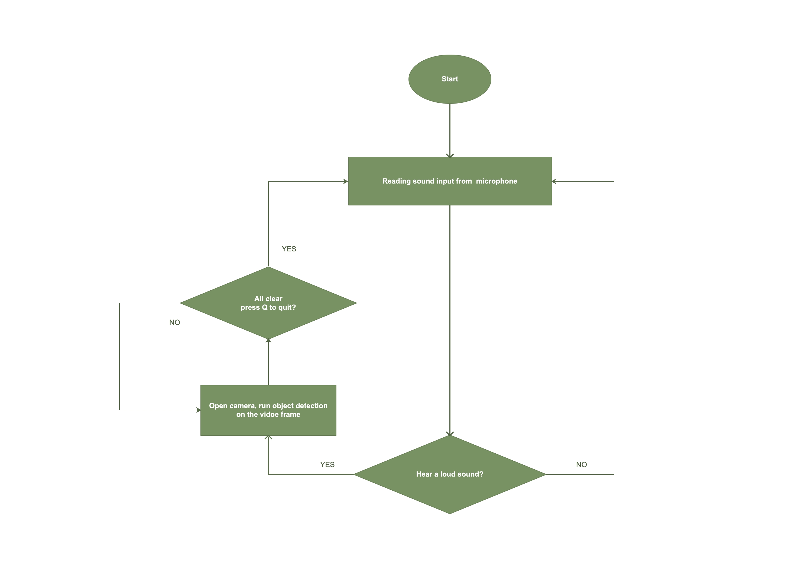

# Safety alert system 
The idea is keep reading input from microphone, when we clearly hear something, open the camera and run object detection on the video frame to check whether or not something is wrong. Maybe in some shady corner of a park or entrance of some private property that people shouldn't be trespassing. 

## 1. Dependencies and implementation of each module 

- PyAudio libraries for sound detecting module: 
  
  Use the API in this library keep collecting surrounding sound, if there is high volumn sound detected, then we open the camera to see whether or not there is suspicious things going on. There is nothing new in this part, we use them(API read input from file/microphone) a lot in class

- CV2 for video processing module:
  
  Read the images from camera/or from the video file and then display the processed images using CV2. I use the API to read and display image frame. Press Q to stop the camera from filming.   

- PyTorch and FaceBook Detectron2 for object detecting module:
  
  [Detectron2 Tutorial](https://detectron2.readthedocs.io/en/latest/tutorials/getting_started.html)
  
  Using the model provided by FaceBook to run object detection on the input images, and boxing the object(in our case, "people" is we we looking for) and display the processed images.

## 2. Control Flow 
Control flow in real scene would be an infinite loop keep monitoring surrounding sound and invoke object detection module on live video frames if there is loud sound.

## 3. Demo and Demo Results

The code logics in demo is a little different from the real scene, its input is from files to simulate the real scene. Because, well, I can't afford a GPU, the price is really skyrocketed after pandemic and I am not Elon Musk. So I have to use what I have, the free GPU from Google Colab, thanks Google for that! But the behavior is slight different in Google Colab, especially the input part, we can't use keyboard, microphone or camera as input for virtual machine in cloud. I do my best to use input file to simulate behavior, hope that's fine. 

The Demo and result can be find [here](DSP_Project.ipynb)

And there is also the python script that stick strict to the behavior of real scene(main.py), if your laptop has GPU and corresponding library installed, you are welcomed to check it out!